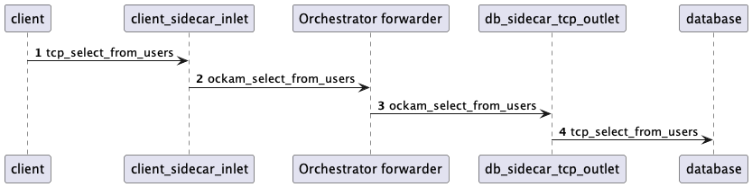

# System architecture

## System functions

Ockam is a suite of tools and services which can be used to build systems supporting secure end-to-end communications with:

 - secure channels
 - inlets / outlets
 - forwarding services
 - credentials
 - ABAC policies
 - etc...

While Ockam can be used in a variety of use cases we are presenting here one use case which highlights some major security claims:

- [create secure communications with a private database](../../guides/examples/create-secure-communication-with-a-private-database-from-anywhere.md) (please refer to the linked example to get a more detailed presentation)

<figure><figcaption></figcaption></figure>

## Private database access

That example shows how securely allow client to access the database, without having to expose any of the database port to the internet. 
Here is a simplified view of the communications when the client sends a message to the database in the scenario above:

### Processes

There are 4 active processes in that scenario:

1. the client executable which can be a web application or the `psql` executable
1. the `client_sidecar` node, started with the `ockam` command line application. It runs in the same private network as the client
1. the `forwarder` node, which is a process started by the Ockam Orchestrator, which runs on AWS
1. the `db_sidecar` node, started with the `ockam` command line application. It runs in the same private network as the database

### Security

At a high-level the security claims in the scenario described above are that:

- messages sent from the client to the database can not be read in clear outside of the private networks because they are encrypted between the inlet and the outlet using a _secure channel_
- both the client and the database can be authenticated via cryptographic identities managed by their respective sidecars
- the database does not expose any port to the internet. It connects to the Orchestrator via the `db_sidecar` which receives messages addressed to the outlet

### Software components

The Ockam components used to support that use case are:

1. the Ockam Orchestrator service, an Elixir application ([private repository](https://github.com/build-trust/ockam-orchestrator)).
2. the Ockam command line application, a Rust application ([public repository](https://github.com/build-trust/ockam))

Note that the Orchestrator also use the `ockam` command line application to start ockam nodes in the cloud. 
The forwarder in the example above is being executed in such a node.

The next sections present in more details the structure of each application and provide links to reference documents explaining how each part works.

## The Ockam application

The code in the [ockam repository](https://github.com/build-trust/ockam) is used to build the `ockam` command line application but is also
structured so that other secure applications can be built, simply using that code as a Rust library.

The main Rust crates composing that repository are the following 

|     | Crate                 | Description                                                                                                                  |
|-----|-----------------------|------------------------------------------------------------------------------------------------------------------------------|
| 1.  | `ockam_core`          | describes abstract notions of `Messages` being sent between `Workers` located at specific `Addresses`                        |
| 2.  | `ockam_node`          | implements a `Router` and concrete asynchronous `Workers` exchanging messages, using a `Transport` between remote nodes      |
| 3.  | `ockam_transport_tcp` | provides a `TcpTransport`. This is where `TcpInlets` and `TcpOutlets` are created                                            |
| 4.  | `ockam_vault`         | implements a `Vault` supporting cryptographic operations and the storage of private keys                                     |
| 5.  | `ockam_identity`      | provides the notion of an `Identity` and supports the creation of `SecureChannels`                                           |
| 6.  | `ockam`               | re-exports most of the functionalities of the previous crates and can be used to build other secure applications             |
| 7.  | `ockam_api`           | implements the notion of an Ockam node and its API to create inlets, outlets, identities, forwarders, secure channels etc... |
| 8.  | `ockam_command`       | interprets command-line arguments as command to start and interact with Ockam nodes                                          |                                                                                                                                    
               
### The `ockam_core` and `ockam_node` crates

Those two crates can be described together since they support the actual communication between Ockam nodes and workers, using transports.
For a more detailed presentation of the routing protocol and the workers system please refer to ["Nodes and Workers"](../../reference/libraries/rust/internals/nodes.md).

### The `ockam_transport_tcp` crate (`ockam_transport_udp` etc...)

This functionality provided by this crate is presented in ["TCP transport"](../../reference/libraries/rust/internals/tcp_transport.md).

### The `ockam_vault` crate

This crate supports:

 - the storage of private keys either locally or remotely (via the [AWS Key Management Service](https://aws.amazon.com/kms))
 - cryptographic operations like: signing, verifying, hashing, encrypting, decrypting

### The `ockam_identity` crate

This crate supports:

1. the management of an `Identity`. An `Identity` uniquely identifies an actor in the system (for example the `db_sidecar` node has an associated `Identity`
   An `Identity` is represented a list of private / public key pairs where one pair is the "root" key and the other pairs are successive key rotations.
   An `Identity` has a cryptographic `IdentityIdentifier` uniquely identifying that identity. More details can be found in ["Vault and identities"](../../reference/libraries/rust/vaults-and-identities.md).

2. the management of `Credentials`. Those are authenticated attributes which can be issued by some identities playing the role of an "authority". 
   Those attributes can be used in the specification of ABAC rules limiting the resources offered by workers and / or other services. More details can be found in ["Vault and identities"](../../reference/libraries/rust/credentials.md)

3. the creation of `SecureChannels`. Secure channels support the encryption and authentication of messages following [the NOISE protocol](https://noiseprotocol.org/noise.html).
   More details can be found [here](../../reference/protocols/secure-channels.md).

### The `ockam` crate

This crate mostly re-exports other functionality. It also provides:

 - the implementation of [the Forwarder service](https://github.com/build-trust/ockam/blob/a2d0bb0e5974c133483fdb3bc72ae4f697001927/implementations/rust/ockam/ockam_api/src/nodes/service/forwarder.rs#L26)
 - some experimental constructs like pipes, channels, and streaming which are not currently being used by the Ockam command line application

### The `ockam_api` crate

The central notion of that crate is the [`NodeManager`](https://github.com/build-trust/ockam/blob/a2d0bb0e5974c133483fdb3bc72ae4f697001927/implementations/rust/ockam/ockam_api/src/nodes/service.rs#L107).
A `NodeManager` represents an active Ockam node running on a physical machine. It aggregates functionalities provided by other crates:

 - a `TcpTransport`
 - a `Router`
 - one or several `Vaults`
 - a default `Identity`
 - a store for authenticated attributes
 - a store for ABAC policies
 - a set of `projects` corresponding to dedicated nodes managed by the Ockam Orchestrator
 - some support code for the management of resources and connections

It offers a request/response API used by the `ockam_command` crate and used to:

- manage transports
- manage identities
- manage secure channels
- manage inlets / outlets
- manage forwarders
- etc...

### The `ockam_command` crate

This crate supports the `ockam` command line application and acts as a front-end to the `ockam-api` to:

 - start/stop nodes
 - manage nodes services via a command-line interface and configuration files / variables

## The Ockam Orchestrator

TODO: @hairyhum
